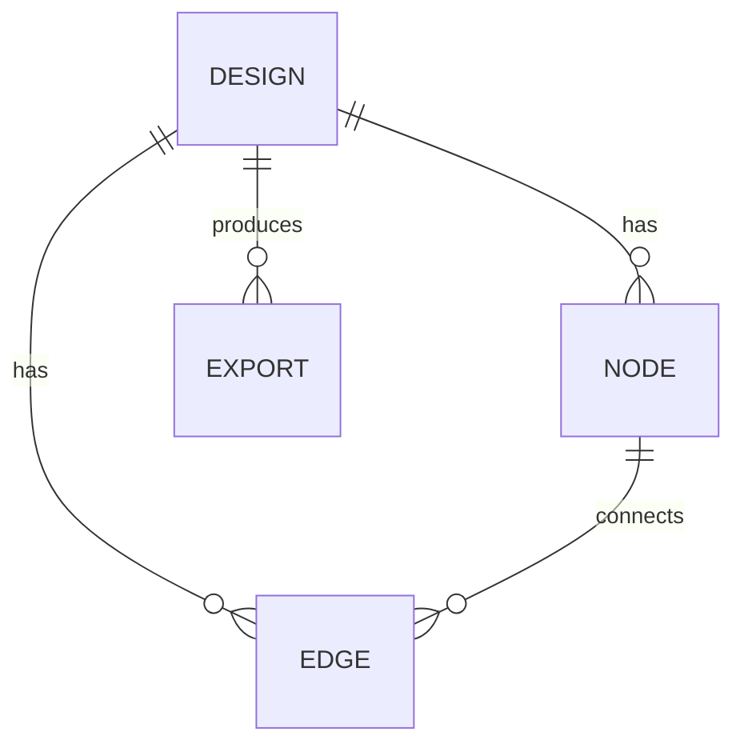

<!-- Generated from docs/intake.md by kickoff v0.1.0. Edit the intake, not this file. -->

# MapDataStructures — Architecture

## Stack

| Layer | Choice |
|---|---|
| Language | TypeScript |
| Frontend | Astro |
| Backend | none |
| Database | none |
| Data layer | none |
| Styling | CSS Modules |
| Tests | Vitest, Playwright |
| Package manager | bun |

Task templates: generic. Notes from the intake: not specified (8.11 was skipped).

## Components

With no backend and no database, everything runs in the visitor's browser and the site ships as static files. Three components follow from the stories.

### Site

The Astro pages: the upload page with the preview and the export buttons, and the page that shows the JSON schema and the sample file. Built to static files and served by Netlify. It talks to nothing server-side; it hands the chosen file to the design core and receives the drawing and the export files back.

### Design core

Owns the Design, Node, and Edge types and the JSON schema they are validated against. Parses the uploaded JSON, reports syntax and schema errors with the line or field, computes a layout, and produces the drawing shown in the preview. Runs in the browser. The layout engine is not specified in the intake.

### Exporters

Four renderers, Markdown, HTML, PDF, and Word, each taking the same laid-out design as the preview, so every format shows the same nodes and edges. Each produces one downloadable file. Run in the browser. The PDF and Word libraries are not specified in the intake.

## Data model

- Design: one uploaded JSON file. Rule: the drawing must faithfully show every node and edge in the JSON, with nothing dropped or mislabeled.
- Node: belongs to a Design; a box or shape with a label and a type.
- Edge: belongs to a Design; connects two Nodes and has a label.
- Export: produced from a Design; one file in Markdown, HTML, PDF, or Word. Rule: every export format must show the same content as the browser preview.

Nothing is stored server-side: a Design and its Exports live only for the request, or in the browser, and are discarded afterward. No entity holds a sensitive category.

## Sign-in and permissions

Nobody signs in. Every visitor sees the same thing.

## Integrations

None. The intake names no external service, so no environment variables are needed and `.env.example` holds no variables.

## Environments and deployment

- Deployment target: Netlify
- Domain: none yet
- Environments: production
- Development database: none
- Production secrets live in: None needed. The site is static with no backend and no integrations, so there are no production secrets. Netlify holds only build settings.

## Non-functional design notes

- Load and speed: one person at a time, drawing within a second of choosing a file, each export within a few seconds. Parsing, layout, and rendering happen in the browser on the main thread for now; a design large enough to break the one-second target is not expected.
- Accessibility: best effort. The upload control, the error messages, and the export buttons are keyboard-reachable and labeled; the drawing carries a text title. No formal audit.
- Devices and browsers: desktop only. Layout targets a desktop viewport; nothing is designed for touch.
- Offline: not required. Because nothing calls a server, a loaded page keeps working without a network, but that is not guaranteed or tested.
- Languages: English only. No internationalization layer.
- Security and compliance: none known. Nothing is stored and no personal data is handled, so there is no data to protect beyond the visitor's own browser session.
- Uptime: hobby. Netlify's free tier, no monitoring.

## Conventions in force

- Default branch protected: false
- Branch prefixes: feature, fix, chore
- Commit style: conventional
- `.env.example` maintained: true
- Handoff docs: true
